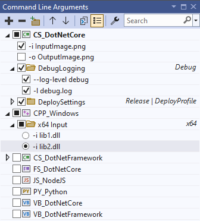
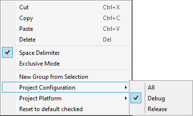

#   Smart Command Line Arguments 
A Visual Studio Extension which aims to provide a better UI to manage your command line arguments

> "The only smart way to pass standard command arguments to programs." - [A happy user](https://marketplace.visualstudio.com/items?itemName=MBulli.SmartCommandlineArguments#review-details)

## Install

Install the extension inside Visual Studio or download it from the Visual Studio Marketplace:

- For VS 2022 go to [Smart Command Line Arguments VS2022](https://marketplace.visualstudio.com/items?itemName=MBulli.SmartCommandlineArguments2022)

- For VS 2019 go to [Smart Command Line Arguments VS2019](https://marketplace.visualstudio.com/items?itemName=MBulli.SmartCommandlineArguments)

- For VS 2017 go to [Smart Command Line Arguments VS2017](https://marketplace.visualstudio.com/items?itemName=MBulli.SmartCommandlineArguments2017)

- For VS 2015 the last supported version is [v2.3.2](https://github.com/MBulli/SmartCommandlineArgs/releases/download/v2.3.2/SmartCmdArgs-v2.3.2.vsix)

Visual Studio 2017, 2019 and 2022 and the following project types are supported:
- C# .Net Framework
- C# .Net Core
- VB .Net
- F#
- C/C++
- Node.js
- Python
- Fortran
- Remote WSL Debugger
- Android Native Debugger
- Oasis NX Debugger

If you're using Cmake make sure to read the [Cmake support wiki page](https://github.com/MBulli/SmartCommandlineArgs/wiki/Cmake-support "Cmake").

## Usage
Open the window via:  
View → Other Windows → Commandline Arguments  

If the Window is open or minimized the commandline arguments should not be edited via the project properties.  
Changes which are made in the window are applied to all project configurations (Release/Debug etc.) of the current startup project.

## Interface
- : Add new line
- : Remove selected lines
- : Add new group
-  / : Move selected lines
- : Copy command line to clipboard. In the example below, the string `-f input_image.png -l latest.log -o out_image.png` is copied to the clipboard.
- : Toggle 'Show all projects' to also display non-startup projects.
- : Open the [Settings](#settings) dialog

## Settings
If the checkboxes are filled with a square the default value is used.
The default value for these settings can be configured under `Tools → Options → Smart Commandline Arguments → Settings Defaults`.

- **Save Settings to JSON**: If true then the these settings are stored in a JSON file next to the solution file.
- **Enable version control support**: If enabled the extension will store the command line arguments into an json file at the same loctation as the related project file. That way the command line arguments might be version controlled by a VCS. If disabled the extension will store everything inside the solutions `.suo-file` which is usally ignored by version control. The default value for this setting is True.
- **Use Solution Directory**: If enabled all arguments of every project will be stored in a single file next to the *.sln file. (Only if version control support is enabled)
- **Enable Macro evaluation**: If enabled Macros like '$(ProjectDir)' will be evaluated and replaced by the corresponding string.

## Hotkeys
- <kbd>CTRL</kbd>+<kbd>↑</kbd> / <kbd>CTRL</kbd>+<kbd>↓</kbd>: Move selected items.
- <kbd>Space</kbd>: Disable/Enable selected items.
- <kbd>Delete</kbd>: Remove selected items.
- <kbd>Insert</kbd>: Add a new item.
- <kbd>Alt</kbd>+<kbd>Insert</kbd>: Add a new group.
- <kbd>Alt</kbd>+<kbd>Enable/Disable Item</kbd>: Disable all other Items (useful if only one item should be enabled).

## Paste

There are three ways to paste items into the list, drag'n'drop, <kbd>CTRL</kbd>-<kbd>V</kbd>, and the context menu.  
There are also three different types of data which can be pasted:
1. Prevously copied or cut items.  
2. Files, here a argument with the full file path is created for each file in the clipboard.
3. Text, where every line is a new argument. (Groups can also be represented, by a line ending with a `:`. Nested groups are done by indenting with a tab.)

## Context Menu

- **Cut** / **Copy** / **Delete**: Cuts/Copies/Deletes the selected items.
- **Paste**: Pastes the previously copied/cut items, text, or files (see [Paste](#paste)).
- **Space Delimiter** (only available while ONE group or project is selected): If this is checked then each argument in the group is seperated by a space when passed to the application.
- **Exclusive Mode** (only available while ONE group or project is selected): If this is checked then the group switches to a radio button mode where only one argument can be checked at any given time.
- **New Group from Selection**: Creates a new Group and moves the selected items into it.
- **Reset to default checked**: Resets every selected arguemnt to the checked state given by the _Default Dhecked_ option.
- **Default Checked**: If this is checked then the argument sould be chekd by default e.g. if someone opens up the project for the first time.
- **Split Argument** (only available while ONE argument is selected): Splits the argument with the typical cmd line parsing rules (e.g. `-o "C:\Test Folder\Output.png"` is split into two arguments `-o` and `"C:\Test Folder\Output.png"`).
- **Project Configuration** / **Launch Profile** / **Project Platform** (only available while ONE group is selected): Shows a sub menu to select a Project Configuration/Launch Profile/Project Platform. If this is set for a group, it is only evaluated if the right Project Configuration/Launch Profile/Project Platform is active.
- **Set as single Startup Project** (only available while ONE project is selected): Sets the selected project as the startup project.

## Donation
If you like this extension you can buy us a cup of coffee or a coke! :D

