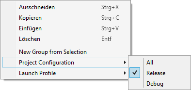

#   Smart Command Line Arguments 
A Visual Studio Extension which aims to provide a better UI to manage your command line arguments  

> "The only smart way to pass standard command arguments to programs." - [A happy user](https://marketplace.visualstudio.com/items?itemName=MBulli.SmartCommandlineArguments#review-details)

## Install
Install the extension inside Visual Studio or download it from the [Visual Studio Marketplace](https://marketplace.visualstudio.com/items?itemName=MBulli.SmartCommandlineArguments "Visual Studio Marketplace").

Visual Studio 2015, 2017 and 2019 and the following project types are supported:
- C# .Net Framework
- C# .Net Core
- VB .Net
- F#
- C/C++ 
- Node.js
- Python (requires a nightly build of PTVS)

If you're using Cmake make sure to read the [Cmake support wiki page](https://github.com/MBulli/SmartCommandlineArgs/wiki/Cmake-support "Cmake").

## Usage
Open the window via:  
View → Other Windows → Commandline Arguments  
  
If the Window is open or minimized the commandline arguments should not be edited via the project properties.  
Changes which are made in the window are applied to all project configurations (Release/Debug etc.) of the current startup project.

## Version Control Support
The extension stores the commandline arguments inside a json file at the same location as the related project file.  
If this new behavior is not welcomed one can fallback to the 'old' mode where the commandline arguments have been stored inside the solutions .suo-file:  
Tools → Options → Smart Commandline Arguments → General → Enable version control support

## Interface
: Add new line  
: Remove selected lines  
: Add new group  
 / : Move selected lines  
: Copy command line to clipboard. In the example below, the string `-f input_image.png -l latest.log -o out_image.png` is copied to the clipboard.  
: Toggle 'Show all projects' to also display non-startup projects.

## Hotkeys
<kbd>CTRL</kbd>+<kbd>↑</kbd> / <kbd>CTRL</kbd>+<kbd>↓</kbd>: Move selected items.  
<kbd>Space</kbd>: Disable/Enable selected items.  
<kbd>Delete</kbd>: Remove selected items.  
<kbd>Insert</kbd>: Add a new item.  
<kbd>Alt</kbd>+<kbd>Insert</kbd>: Add a new group.  
<kbd>Alt</kbd>+<kbd>Enable/Disable Item</kbd>: Disable all other Items (useful if only one item should be enabled).

## Paste

There are three ways to paste items into the list, drag'n'drop, <kbd>CTRL</kbd>-<kbd>V</kbd>, and the context menu.  
There are also three different types of data which can be pasted:
1. Prevously copied or cut items.  
2. Files, here a argument with the full file path is created for each file in the clipboard.
3. Text, where every line is a new argument. (Groups can also be represented, by a line ending with a `:`. Nested groups are done by indenting with a tab.)

## Context Menu

**Cut** / **Copy** / **Delete**: Cuts/Copies/Deletes the selected items.  
**Paste**: Pastes the previously copied/cut items, text, or files (see [Paste](#paste)).

**New Group from Selection**: Creates a new Group and moves the selected items into it.  
**Split Argument** (only available while ONE argument is selected): Splits the argument with the typical cmd line parsing rules (e.g. `-o "C:\Test Folder\Output.png"` is split into two arguments `-o` and `"C:\Test Folder\Output.png"`).  
**Project Configuration** / **Launch Profile** (only available while ONE group is selected): Shows a sub menu to select a Project Configuration/Launch Profile. If a Project Configuration/Launch Profile is set for a group, it is only evaluated if this Project Configuration/Launch Profile is active.  
**Set as single Startup Project** (only available while ONE project is selected): Sets the selected project as the startup project.

## Donation
If you like this extension you can buy us a cup of coffee or a coke! :D

